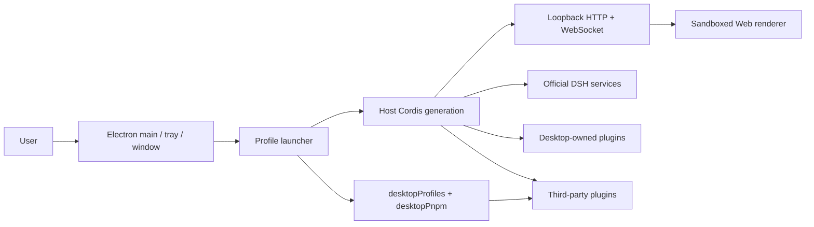

<h1 align="center">DeepSeek Harness Desktop (DSH Desktop)</h1>

<p align="center">
  <strong>An open-source DeepSeek Harness desktop client for Windows and macOS.</strong><br>
  Electron, Node.js, pnpm, and pinned official DSH dependencies are included, so you can install and launch without setting up a command-line environment.
</p>

<p align="center"><sub>Community maintained and not an official DeepSeek product. <a href="README.md">中文</a> · English</sub></p>

<p align="center">
  <a href="https://github.com/w13136199130/deepseek-harness-desktop/releases/latest"></a>
  <a href="https://github.com/w13136199130/deepseek-harness-desktop/releases"></a>
  <a href="https://github.com/w13136199130/deepseek-harness-desktop"></a>
  <a href="LICENSE"></a>
  
</p>

DSH Desktop packages the local Web UI, Host service, and plugin system from [DeepSeek Harness](https://github.com/deepseek-ai/deepseek-harness) into a native desktop application. Official Harness runs unchanged at a pinned version (source locked as a submodule, runtime from official npm packages); Desktop only provides the window, tray, terminal, updates, and work profiles, composed into the same runtime through the official Cordis plugin mechanism.

## Download and install

Current release artifacts support Windows x64 and macOS. Ordinary users do not need to install Node.js, pnpm, or DSH separately.

| Platform | Download | Installation |
| --- | --- | --- |
| Windows x64 | [GitHub Releases installer](https://github.com/w13136199130/deepseek-harness-desktop/releases/latest) | Run the NSIS installer and follow its prompts |
| macOS | [GitHub Releases app](https://github.com/w13136199130/deepseek-harness-desktop/releases/latest) | Download and move it into Applications (see release notes for signing and notarization) |

> Unsigned note: local and CI Windows installers are unsigned by default (no Authenticode publisher), so Windows may show an Unknown publisher or SmartScreen warning; signed releases are a separate gate. The first launch creates the default `desktop` profile and starts the official DSH Web interface.

## Features

- **Native desktop experience**: window, system tray, locale-aware tray menu, and a unified brand-blue application icon.
- **Two presentation modes**: compatibility (ordinary native window + official Web UI) and advanced (Windows 11 Mica / macOS sidebar vibrancy).
- **Work profiles**: switch DSH profiles from the tray; on Windows the workspace picker lists every drive so any volume is reachable.
- **DSH terminal**: open a system terminal rooted at the active profile from the tray (macOS Terminal / Windows PowerShell 7 or cmd) with private `dsh`, `pnpm`, and `node` shims.
- **Update checks**: built-in product update endpoint (currently a placeholder; enabled after deployment).
- **Windows security sandbox**: PowerShell execution keeps the upstream ACL restricted-token sandbox, fail-closed, with no unrestricted fallback.

## Architecture

The desktop app is a thin Electron host: it boots the official DSH Host in the Electron main process, the Host serves the official Web UI over loopback HTTP/WebSocket, and Electron loads the same-origin page in a sandboxed renderer — no Electron-owned plugin roster, preload bridge, or raw Electron API in the renderer.



- **Official capabilities unchanged**: agent / models / tools / sessions / settings / sandbox / Web UI all come from official packages, zero fork, zero modification.
- **Desktop capabilities are plugin rows**: `desktop-shell` (window/tray/lifecycle), `desktop-terminal`, `desktop-pnpm`, `desktop-profiles`, `desktop-updates`, mounted by the official Loader and disposed with the generation.
- **Self-contained**: bundled pnpm + Electron-as-Node; users need no Node/pnpm/DSH install. Profile plugin management reuses the official `dsh plugin --profile` CLI.
- **Configuration isolation**: `deepseek-harness-desktop.mode` (compatibility/advanced) is the single source of truth in the DSH home `settings.yaml`; switching applies through an orderly restart.

See [docs/BLUEPRINT.md](docs/BLUEPRINT.md) for the full design.

## Relationship to the Official Project

This project is built on [deepseek-ai/deepseek-harness](https://github.com/deepseek-ai/deepseek-harness) as a community implementation of the DSH desktop experience.

The official project provides the core agent capabilities, plugin system, and Web UI. This project primarily provides:

- Desktop application packaging (Electron shell + window/tray/terminal)
- Local Host service startup, profile management, and updates
- macOS / Windows installer builds and releases
- Native experience designed for desktop use

If you prefer to run Harness from the command line or contribute to its core functionality, refer to the official repository first.

## Development

Desktop source lives in `deepseek-harness-desktop/`. The outer repository uses Yarn; the pinned `deepseek-harness/` submodule keeps its own pnpm workspace, isolated from it. From the repository root:

```sh
git submodule update --init --recursive
corepack yarn install --immutable
corepack yarn dev        # build and launch the desktop app
corepack yarn check      # layout gate + desktop build/typecheck/test/closure/licenses
```

Packaging:

```sh
corepack yarn dist:win   # Windows x64 NSIS installer (requires a native Windows host)
corepack yarn dist:mac   # macOS signed and notarized (requires macOS and release credentials)
```

Releases (GitHub Releases): pushing a `v*` tag triggers the [Release workflow](.github/workflows/release.yml), which builds and uploads Windows and macOS artifacts. Before releasing, confirm the items below.

### Pre-release checklist

- `build.appId` in `deepseek-harness-desktop/package.json` (currently the placeholder `com.example.deepseek-harness-desktop`).
- Update/download endpoints (`src/update-checker.ts` / `update-download.ts`; currently `updates.example.com` placeholders with automatic checks disabled).
- macOS signing and notarization credentials (`CSC_*` / `APPLE_*`, see `scripts/release-preflight.ts`); the Windows code-signing certificate is optional.

## Upstream sync

When official DeepSeek Harness updates, update in a dedicated commit: the `deepseek-harness/` submodule gitlink, `upstream.json`, and the desktop `@deepseek-ai/dsh-*` runtime dependency versions, then run `yarn check`. See [docs/UPSTREAM-SYNC.md](docs/UPSTREAM-SYNC.md).

## Special Thanks

Thanks to the [original DeepSeek Harness repository](https://github.com/deepseek-ai/deepseek-harness) and the DeepSeek AI team. DSH Desktop is built from a pinned upstream checkout; its core agents, models, tools, sessions, Web UI, and plugin ecosystem all come from that project.

We also thank [Cordis](https://github.com/cordiverse/cordis) for the plugin foundation, and everyone who contributes discussions, testing, feedback, and development.

## License

This project is licensed under the [MIT License](LICENSE).

> This is a community desktop edition built on DeepSeek Harness. It is not an official DeepSeek product.
>
> DeepSeek is a trademark of DeepSeek AI. DSH Desktop is an independent community project, not affiliated with or endorsed by DeepSeek.
