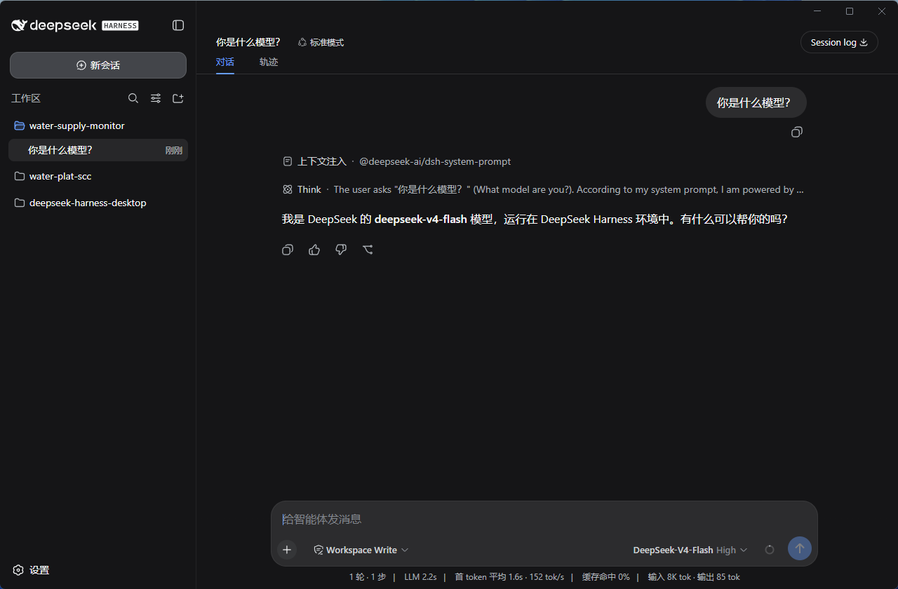
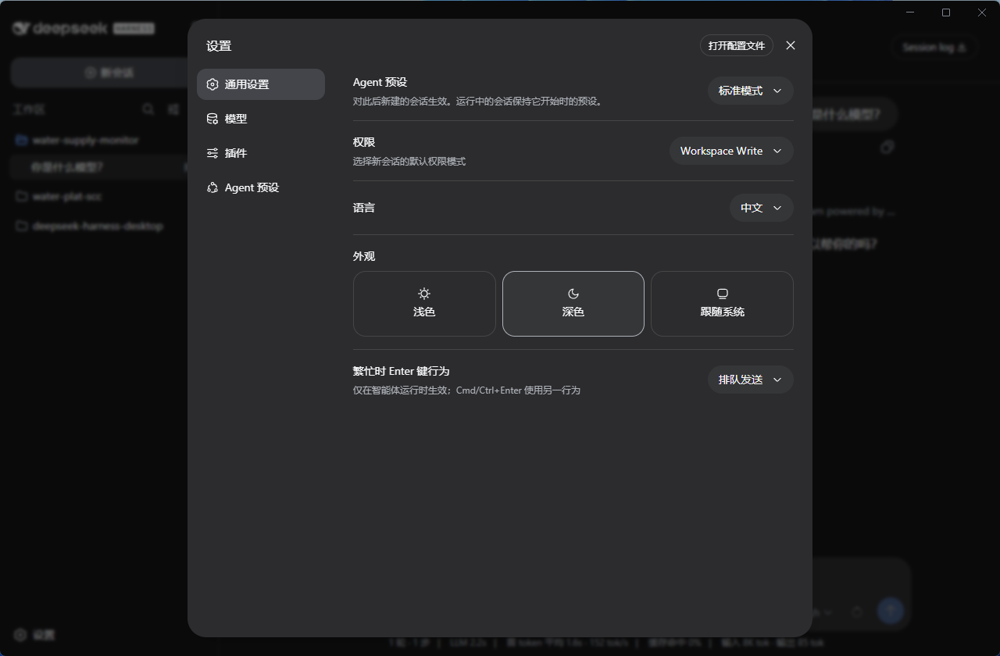
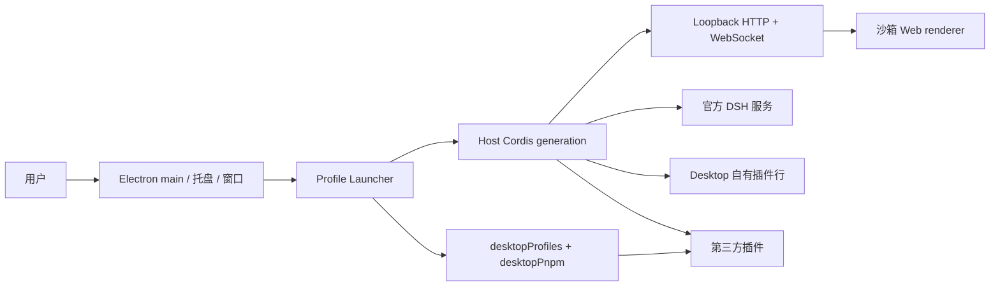

<h1 align="center">DeepSeek Harness Desktop（DSH Desktop）</h1>

<p align="center">
  <strong>面向 Windows 与 macOS 的 DeepSeek Harness 桌面客户端。</strong><br>
  内置 Electron、Node.js、pnpm 与固定版本的官方 DSH 依赖，无需配置命令行环境，下载安装即可使用。
</p>

<p align="center"><sub>社区维护的开源项目，并非 DeepSeek 官方产品。中文 · <a href="README.en.md">English</a></sub></p>

<p align="center">
  <a href="https://github.com/w13136199130/deepseek-harness-desktop/releases/latest"></a>
  <a href="https://github.com/w13136199130/deepseek-harness-desktop/releases"></a>
  <a href="https://github.com/w13136199130/deepseek-harness-desktop"></a>
  <a href="LICENSE"></a>
  
</p>

DSH Desktop 把 [DeepSeek Harness](https://github.com/deepseek-ai/deepseek-harness) 的本地 Web UI、Host 服务与插件系统装进原生桌面应用。官方 Harness 以固定版本**原样运行**（源码以 submodule 锁定，运行时使用官方 npm 发布包）；Desktop 只负责窗口、托盘、终端、更新与工作配置，并通过**官方 Cordis 插件机制**与 Harness 组合进同一个运行时。

## 下载与安装

当前发布产物支持 Windows x64 与 macOS。普通用户不需要单独安装 Node.js、pnpm 或 DSH。

| 平台 | 下载 | 安装方式 |
| --- | --- | --- |
| Windows x64 | [GitHub Releases 安装程序](https://github.com/w13136199130/deepseek-harness-desktop/releases/latest) | 运行 NSIS 安装程序并按提示完成安装 |
| macOS | [GitHub Releases 应用](https://github.com/w13136199130/deepseek-harness-desktop/releases/latest) | 下载后放入 Applications（签名与公证见发布说明） |

> 未签名说明：本地与 CI 的 Windows 安装包默认**未签名**（无 Authenticode 发布者），Windows 可能显示 Unknown publisher 或 SmartScreen 警告；正式签名与公证是独立的发布门禁。首次启动会创建默认 `desktop` profile 并启动官方 DSH Web 界面。

## 主要功能

- **原生桌面体验**：窗口、系统托盘、托盘菜单（跟随系统语言）与应用图标统一品牌蓝。
- **双呈现模式**：兼容模式（普通原生窗口 + 官方 Web UI）与高级模式（Windows 11 Mica 毛玻璃 / macOS 侧边栏 vibrancy）。
- **工作配置**：通过托盘切换 DSH profile；Windows 工作区选择默认列出所有盘符，任意卷可达。
- **DSH 终端**：托盘一键打开以当前 profile 为工作目录的系统终端（macOS Terminal / Windows PowerShell 7 或 cmd），内置私有 `dsh`、`pnpm`、`node` shim。
- **更新检查**：内置产品更新端点（当前为占位，部署后启用）。
- **Windows 安全沙箱**：PowerShell 执行保持上游 ACL 受限令牌沙箱，fail-closed，不自动降权。

## 界面预览

官方 DSH Web 界面在桌面窗口中原样呈现：左侧为会话列表与工作区，中间为对话与智能体运行轨迹，右侧为设置面板。以下为运行效果：

<p align="center">
  
  
</p>

## 架构设计

桌面应用是一个薄的 Electron 宿主：在 Electron main 进程中启动官方 DSH Host，Host 通过 loopback HTTP/WebSocket 提供官方 Web UI，Electron 在沙箱 renderer 中加载同源页面——没有 Electron 自有插件 roster、preload bridge 或渲染进程 Electron API。



- **官方能力原样**：agent / 模型 / 工具 / 会话 / 设置 / 沙箱 / Web UI 全部来自官方包，零 fork、零修改。
- **桌面能力是插件行**：`desktop-shell`（窗口/托盘/生命周期）、`desktop-terminal`、`desktop-pnpm`、`desktop-profiles`、`desktop-updates`，随官方 Loader 挂载、随 generation dispose。
- **自包含**：内置 pnpm + Electron-as-Node，用户无需安装 Node/pnpm/DSH；profile 插件管理复用官方 `dsh plugin --profile` CLI。
- **配置隔离**：`deepseek-harness-desktop.mode`（compatibility/advanced）由 DSH home `settings.yaml` 单一事实源控制，切换通过有序重启生效。

详细设计见 [docs/BLUEPRINT.md](docs/BLUEPRINT.md)。

## 与官方项目的关系

本项目基于 [deepseek-ai/deepseek-harness](https://github.com/deepseek-ai/deepseek-harness) 构建，是对 DSH 桌面体验的社区实现。

官方项目提供核心智能体能力、插件系统与 Web UI。本项目主要负责：

- 桌面应用封装（Electron 壳 + 窗口/托盘/终端）
- 本地 Host 服务的启动、profile 管理与更新
- macOS / Windows 安装包构建与发布
- 适合桌面使用的原生体验

如果你希望从命令行运行 Harness，或参与核心功能开发，请优先查看官方仓库。

## 开发

桌面端代码位于 `deepseek-harness-desktop/`，外层仓库使用 Yarn；固定的 `deepseek-harness/` submodule 保持上游自己的 pnpm workspace，二者隔离。从仓库根目录执行：

```sh
git submodule update --init --recursive
corepack yarn install --immutable
corepack yarn dev        # 构建并启动桌面应用
corepack yarn check      # 布局门禁 + 桌面包 build/typecheck/test/闭包/许可 全量验证
```

打包：

```sh
corepack yarn dist:win   # Windows x64 NSIS 安装包（需在原生 Windows 上执行）
corepack yarn dist:mac   # macOS 签名与公证（需在 macOS 上执行，需发布凭据）
```

发布（GitHub Releases）：推送 `v*` 标签即触发 [Release 工作流](.github/workflows/release.yml)，自动构建并上传 Windows 与 macOS 产物。发布前请确认发布必改项（见下）。

### 发布前必改项

- `deepseek-harness-desktop/package.json` 的 `build.appId`（当前 `com.example.deepseek-harness-desktop` 为占位）。
- 更新/下载端点（`src/update-checker.ts` / `update-download.ts`，当前 `updates.example.com` 占位，自动检查默认禁用）。
- macOS 签名与公证凭据（`CSC_*` / `APPLE_*`，见 `scripts/release-preflight.ts`）；Windows 代码签名证书可选。

## 上游同步

官方 DeepSeek Harness 更新时，在**独立提交**中同时更新 `deepseek-harness/` submodule gitlink、`upstream.json` 与桌面包 `@deepseek-ai/dsh-*` 运行时依赖版本，并跑通 `yarn check`。操作手册见 [docs/UPSTREAM-SYNC.md](docs/UPSTREAM-SYNC.md)。

## 特别感谢

感谢 [DeepSeek Harness 原始仓库](https://github.com/deepseek-ai/deepseek-harness) 与 DeepSeek AI 团队。DSH Desktop 基于固定版本的上游源码构建，核心智能体、模型、工具、会话、Web UI 与插件生态均来自该项目。

同时感谢 [Cordis](https://github.com/cordiverse/cordis) 提供的插件化基础，以及所有参与讨论、测试、反馈与开发的社区成员。

## License

本项目遵循 [MIT License](LICENSE)。

> 本项目是基于 DeepSeek Harness 构建的社区桌面版本，并非 DeepSeek 官方产品。
>
> DeepSeek 是 DeepSeek AI 的商标。DSH Desktop 是独立的社区项目，与 DeepSeek 官方没有隶属关系，也未获得其背书。
